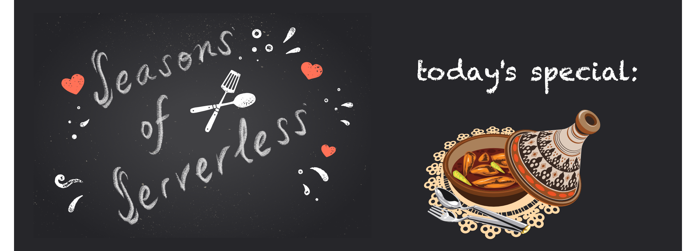

# Challenge 7: The Recipe Connector

**Your Chefs: Bethany Jepchumba, Adefemi Afuwape and Felix Omuok, Microsoft Student Ambassadors**
## This week's featured region: Africa

In Africa, city cooks want to reconnect with their country roots. In Kenya, there are many traditional dishes, but no one in Nairobi remembers how to make them! In Lagos, Nigeria, cooks are eager to recreate their grandmother's famous jollof rice, but they can't quite remember the proportions of ingredients. Let's set up a City/Country hotline!

## Your challenge 🍽 

Create a service that will allow a user to send a query for a specific dish to a regional hotline center and receive the appropriate and authentic recipe. This is a great moment to try Azure Maps to work with geoJSON and experiment with serving recipes for each region.

## Resources/Tools Used 🚀

-   **[Visual Studio Code](https://code.visualstudio.com/?WT.mc_id=academic-10922-cxa)**
-   **[Postman](https://www.getpostman.com/downloads/)**
-   **[Azure Functions Extension](https://marketplace.visualstudio.com/items?itemName=ms-azuretools.vscode-azurefunctions&WT.mc_id=academic-10922-cxa)**

## Next Steps 🏃

Learn more about serverless!

  ✅ **[Serverless Free Courses](https://docs.microsoft.com/learn/browse/?term=azure%20functions&WT.mc_id=academic-10922-cxa)**

## Important Resources ⭐️

  ✅ **[Azure Functions documentation](https://docs.microsoft.com/azure/azure-functions/?WT.mc_id=academic-10922-cxa)**
  
  ✅ **[Azure SDK for JavaScript Documentation](https://docs.microsoft.com/azure/javascript/?WT.mc_id=academic-10922-cxa)**
  
  ✅ **[Create your first function using Visual Studio Code](https://docs.microsoft.com/azure/azure-functions/functions-create-first-function-vs-code?WT.mc_id=academic-10922-cxa)**
  
  ✅ **[Free E-Book - Azure Serverless Computing Cookbook, Second Edition](https://azure.microsoft.com/resources/azure-serverless-computing-cookbook/?WT.mc_id=academic-10922-cxa)**

## Ready to submit a solution to this challenge? Here's how 🚀 

Open an [issue](https://github.com/microsoft/Seasons-of-Serverless/issues/new?assignees=&labels=&template=seasons-of-serverless-solution.md&title=Solution) in this repo, with a link to your challenge and a brief explanation of how you solved it. We will take a look, approve it if appropriate, and a tag with the appropriate week. If your solution is picked as a weekly standout solution, we'll send you a little prize!

